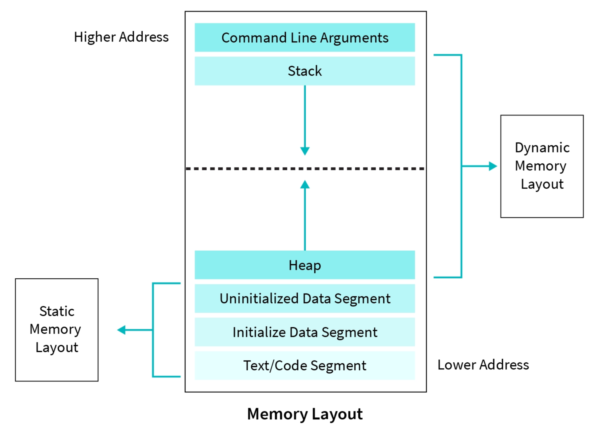

# Memória
## Endereços de Memória
Toda variável é um espaço na memória do computador que armazena um dado. Podemos obter qual espaço da memória aquela variável está atribuida da seguinte forma:
```cpp
int x = 10;
cout << &x << endl;
```
`&x` é o endereço de memória de `x`

Ao declarar uma variável, o compilador atribui um espaço na memória para ela, logo, se não a inicializarmos com algum valor, ela irá pegar o chamado "lixo", pegando um valor qualquer que possa estar naquele espaço de memória

## Referências
Uma referência é um alias para uma variável (Apelido).
```cpp
int x = 10;
int& ref = x;

ref = 20;
cout << x << endl;  // Saída é 20
```
As referências não ocupam um novo espaço na memória do computador, elas são apenas um novo rótulo para a variável antes estabelecida

## Ponteiros
Ponteiros são variáveis que armazenam endereços de memória
```cpp
int x = 10;
int* p = &x;
```
`p` recebe um endereço de memória de um **inteiro**. Para acessar o valor armazenado no espaço guardado pelo ponteiro utilizamos o operador de desreferência `*`
```cpp
cout << *p << endl;  // Mostra 10
```

Para evitar lixos de memória armazenados em ponteiros não inicializados, podemos utilizar o nullptr.
```cpp
int * p1;  // Pode fazer, mas não é recomendado
//--------------------------------
int * p2 = nullptr;  // Recomendado
```

## Alocação Dinâmica
Vimos até agora o método de alocação autoática de memória, onde o programa, ao criarmos a variável, automaticamente atribuia um endereço de memória a ela. Na alocação dinâmica, seguimos o seguinte passo a passo:

- Alocar a memória com o operador `new`
- Guardar o endereço de memória em um ponteiro
- Usar o ponteiro para modificar e acessar os dados
- Liberar a memória com o operador `delete`

Ou seja, teremos um ponteiro que apontará para um espaço de memória alocado sem rótulo (Não é de nenhuma variável declarada anteriormente)

```cpp
int* p = new int;
*p = 10;  // Agora esse valor só pode ser acessado pelo ponteiro (Não há nenhuma variável com o endereço específico para esse valor)
delete p;
```

Caso a memória não seja liberada, ocorrerá um *memory leak*, onde a memória nunca é liberada e espaço desnecessário na memória é utilizado

Veja a seguinte imagem:



- **Memória Stack:** Armazena variáveis locais e chamadas de funções. Se comporta como uma "pilha", onde apenas o primeiro espaço pode ser removido ou adicionado, sem alterar os anteriores;
- **Memória Heap:** Armazenamento de variáveis dinamicamente alocadas;
- **Data Segment:** Armazena variáveis globais e estáticas (Acessadas por todo o programa)
- **Text Segment:** Código em texto

## Smart Pointers
Embora `new` e `delete` sejam úteis (e os ultilizaremos nas aulas), eles podem levar a vazamentos de memória na prática. Em C++, é recomendado o uso de smart pointers como `std::unique_ptr` e `std::shared_ptr`. A ideia dessas classes é controlar o número de referências (variáveis) apontando para a memória alocada. Quando esse número chega a zero, o próprio smart pointer libera a memória de forma segura.

```cpp
#include <memory>

std::unique_ptr<Pessoa> p = std::make_unique<Pessoa>("Ana", 30);
cout << "Nome: " << p->nome << endl;
```
