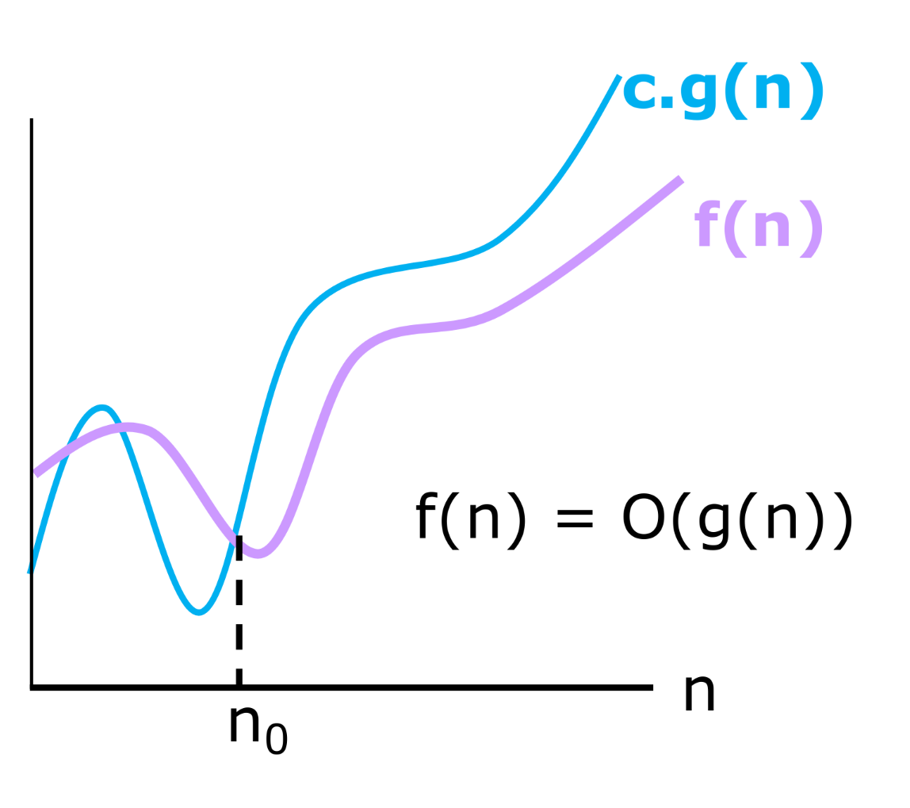

# Complexidade de Algoritmos
## Definição
A complexidade de um algoritmo diz quanto de memória / tempo ele utiliza para ser terminado com base no input inicial do programa. Geralmente esse input é o tamanho do problema / quantidade de elementos a serem processados. Inclusive, em certos casos, mais de um parâmetro pode influenciar no problema, como quando trabalhamos com grafos ou matrizes

## Tipos de Complexidade
* **Complexidade Temporal**: Mede quanto tempo (Ou número de operações) o programa precisa para ser terminado
* **Complexidade Espacial**: Mede a quantidade de memória necessária para executar o algoritmo

### Exemplo
Considere a função que calcula a média dos elementos de um array:
```cpp
float media(float arr[], int n) {
    float total = 0;
    for(int i = 0; i < n; i++) {
        total += arr[i];
    }
    return total / n;
}
```
* **Complexidade Espacial**: Além do vetor inicial, a função só utiliza de duas variáveis auxiliares, `total` e `i`, logo, seu consumo de memória não escalona, sendo *constante*, logo, denotamos a complexidade espacial como O(1)
* **Complexidade Temporal**: Percebemos que, quanto maior o tamanho do vetor inicial passado, mais o algoritmo irá demorar para terminar de executar, logo, ele cresce linearmente. Porém, no pior caso possível, o código percorre TODOS os elementos do array, portanto, a complexidade temporal do algoritmo é O(n)

## Como calcular (Análise Assintótica)
Aqui utilizaremos apenas o cálculo da complexidade temporal, já que a espacial costuma sempre ser linear as entradas ou contante na maioria dos algoritmos

Quando tratamos da Big O Notation (O(x)), nós escrevemos a complexidade temporal como um polinômio, mas sempre pegamos o de grau maior:

* *T<sub>1</sub>* = N + 5000
* *T<sub>2</sub>* = N² + N + 1

Com termos menores, o segundo algoritmo tem um tempo de execução maior, porém, quanto mais aumentamos a entrada do vetor, maior fica a execução do segundo, até um ponto que ele fica muito mais demorado que o primeiro. Então para análise dos algoritmos, fazemos um limite com N indo para o infinito, logo, o termo de maior grau será o que mais influencia no crescimento do algoritmo, logo, teríamos:

* Complexidade *T<sub>1</sub>* = O(N)
* Complexidade *T<sub>2</sub>* = O(N<sup>2</sup>)

Logo, sempre consideramos o caso de N &rarr; $ \infty $;

### Definição
Sejam *g* e *f* duas funções de domínio $ X $. Dizemos que $ f(n) = O(g(n)) $ se existir uma constante $ c \in \reals_{+} $ e um valor $ n_{0} \in X $ tal que $ \forall n \ge n_{0} $ temos $ |f(n)| \le c|g(n)| $



#### Exemplos
* $ 3N + 2 = O(N) $, pois $ 3N + 2 \le 4N $, $ \forall N \ge 2 $
* Generalizando: Dado um algoritmo de complexidade $ \sum_{k=0}^{m}c_{k}M^k = c_{m}M^m + c_{m-1}M^{m-1} + ... + c_0 = O(N^m)$, 

## Algumas das principais complexidades
| **Notação**       | **Descrição**          | **Descrição**                                                                                       | **Exemplos de Algoritmos**                                                     |
|-------------------|------------------------|-----------------------------------------------------------------------------------------------------|------------------------------------------------------------------------------------------------------|
| **$O(1)$**        | **Constante**          | O tempo de execução não depende do tamanho da entrada.                                              | - Acesso a um elemento em um vetor ou lista: `arr[i]`.                                                         |
| **$O(log(n))$**   | **Logarítmica**        | O tempo de execução cresce de forma logarítmica em relação ao tamanho da entrada.                   | - Busca binária em um vetor ordenado.                                                                         |
| **$O(n)$**        | **Linear**             | O tempo de execução cresce linearmente com o tamanho da entrada.                                    | - Busca sequencial em um vetor.                                                                               |
| **$O(n log(n))$** | **Linear-Logarítmica** | O tempo de execução cresce mais rápido que O(n), mas menos que O(n^2).                              | - Algoritmos de ordenação eficientes como Merge Sort, Quick Sort.                                       |
| **$O(n^2)$**      | **Quadrática**         | O tempo de execução cresce quadraticamente com o tamanho da entrada.                                | - Ordenação por bolha (Bubble Sort).                                                                    |
| **$O(2^n)$**      | **Exponencial**        | O tempo de execução cresce muito rapidamente com o aumento do tamanho da entrada.                   | - Algoritmo de força bruta para resolver o problema da mochila.                                         |
| **$O(n!)$**       | **Fatorial**           | O tempo de execução cresce ainda mais rapidamente que O(2^n), com uma taxa de crescimento fatorial. | - Algoritmo de força bruta para resolver o problema do caixeiro viajante (Travelling Salesman Problem). |

Veja a comparação na imagem abaixo


