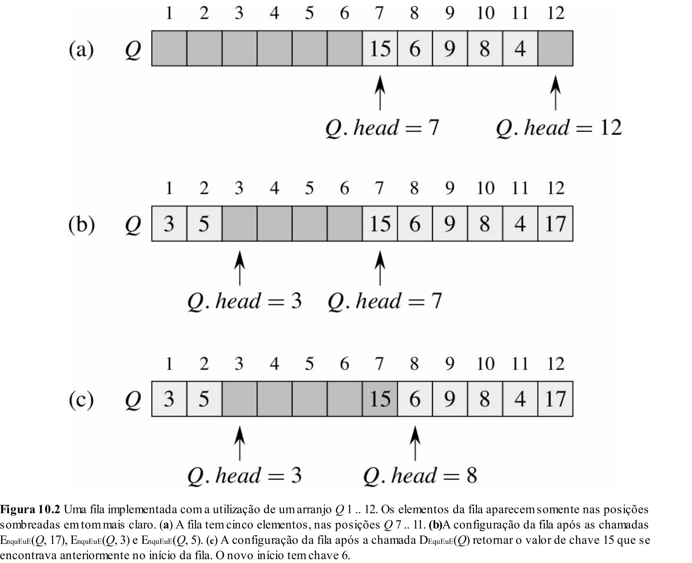

# Tipos Abstratos de Dados
## O que é?
Até agora, mexemos com tipos primitivos (int, char, double, ...). Esses tipos de dados possuem tamanho específico na memória, um método de armazenamento no computador. Os TAD, pelo contrário, são definidos por um conjunto de atributos e funções que representam seu comportamento


## Definição Formal
Um Tipo Abstrato de Dados (TAD) é um modelo conceitual de uma estrutura de dados que define um conjunto de operações sem especificar como elas são implementadas. Diferente dos tipos primitivos, que possuem uma representação direta na memória, um TAD é definido em termos de comportamento e operações permitidas, sem impor detalhes sobre sua implementação.

Na prática, para criar um TAD, utilizamos estruturas de dados concretas, como arrays e ponteiros, e definimos funções que respeitam a interface do TAD.


## Pilhas
TAD que segue uma política LIFO (Last in, First out), ou seja, ao inserir um elemento, ele deve ser o último a ser inserido, apenas no final, e ao retirar, apenas o primeiro elemento da pilha pode ser retirado

### Utilizações

- Controle de chamadas de funções (pilha de execução do sistema operacional);
- Desfazer/refazer ações em editores de texto e backtracking;
- Avaliação de expressões matemáticas (sintaxe de uma linguagem de programação);
- Percursos em grafos (como busca em profundidade, DFS).

### Implementação com arrays
```cpp
typedef struct {
    int * data;
    int maxSize;
    int top;
} Stack;

Stack* initialization(int maxSize) {
    Stack * s = new Stack();
    s->data = new int[maxSize];
    s->maxSize = maxSize;
    s->top = -1;
    return s;
}

void destroy(Stack* s) {
    delete[] s->data;
    delete s;
}

int push(Stack *s, int value) {
    if (s->top == s->maxSize - 1) {
        return 0; // Full stack
    }
    s->top += 1;
    s->data[s->data] = value;
    return 1;
}

int pop(Stack *s, int *value) {
    if (s->top == -1) {
        return 0; // Empty stack
    }
    s->top -= 1;
    *value = s->data[s->data + 1];
    return 1;
}

int peek(const Stack *s, int *value) {
    if (s->top == -1) {
        return 0; // Empty stack
    }
    *value = s->data[s->top];
    return 1;
}
```

## Filas
TAD que segue a política FIFO (First in, First out). Funciona como uma fila mesmo, o primeiro a chegar é o primeiro a ser retirado

### Utilizações
- Processamento de eventos (ordem de chegada);
- Assistir mais tarde (Youtube);
- Percursos em grafos (como busca em largura, BFS).

### Implementação com arrays
```cpp
typedef struct {
    int* data;
    int maxSize;
    int size;
} Queue;

Queue * initialization(int maxSize) {
    Queue * q = new Queue();
    q->data = new int[maxSize];
    q->maxSize = maxSize;
    q->size = 0;
    return q;
}

void destroy(Queue* q) {
    delete[] q->data;
    delete q;
}

int enqueue(Queue *q, int value) {
    if (q->size == q->maxSize) {
        return 0; // Fila cheia
    }
    q->data[q->size] = value;
    q->size += 1;
    return 1;
}

int dequeue(Queue *q, int *value) {
    if (q->size == 0) {
        return 0; // Fila vazia
    }

    *value = q->data[0];
    for (int i = 1; i < q->size; i++) {
        q->data[i - 1] = q->data[i];
    }
    q->size -= 1;
    return 1;
}

int peek(const Queue *q, int *value) {
    int peek(const Queue *q, int *value) {
    if (q->size == 0) {
        return 0; // Fila vazia
    }
    *value = q->data[0];
    return 1;
}
```

### Implementando com listas circulares
Um problema das listas, é que elas podem gerar memória não utilizada desnecessariamente, para contornar isso, utilizamos de listas circulares:



Implementação dos métodos:
```cpp
typedef struct {
    int *data;
    int maxSize;
    int size;
    int head;
    int tail;
} CircularQueue;

CircularQueue * initialization(int maxSize) {
    CircularQueue * q = new CircularQueue();
    q->data = new int[maxSize];
    q->head = 0;
    q->tail = -1;
    q->size = 0;
}

int enqueue(CircularQueue *q, int value) {
    if (q->size == q->maxSize) {
        return 0; // Fila cheia
    }
    q->tail = (q->tail + 1) % q->maxSize;
    q->data[q->tail] = value;
    q->size++;
    return 1;
}

int dequeue(CircularQueue *q, int *value) {
    if (q->size == 0) {
        return 0; // Fila vazia
    }
    *value = q->data[q->head];
    q->head = (q->head + 1) % q->maxSize;
    q->size--;
    return 1;
}

int peek(CircularQueue *q, int *value) {
    if (q->size == 0) {
        return 0; // Fila vazia
    }
    *value = q->data[q->head];
    return 1;
}
```
